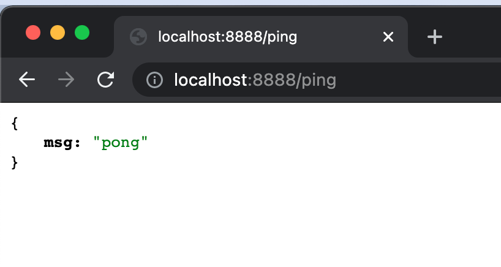
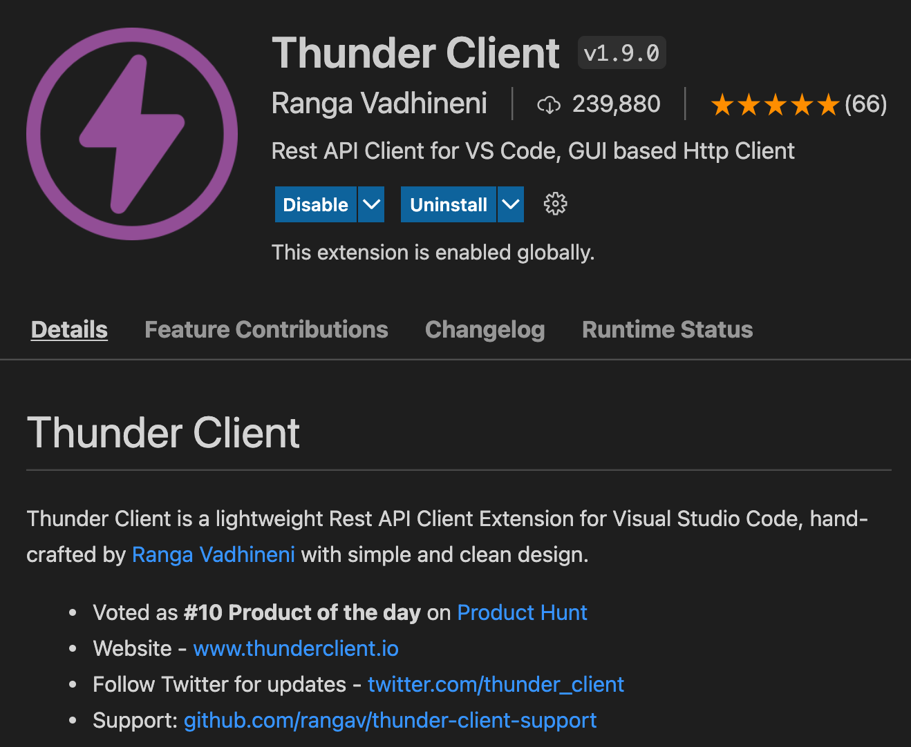
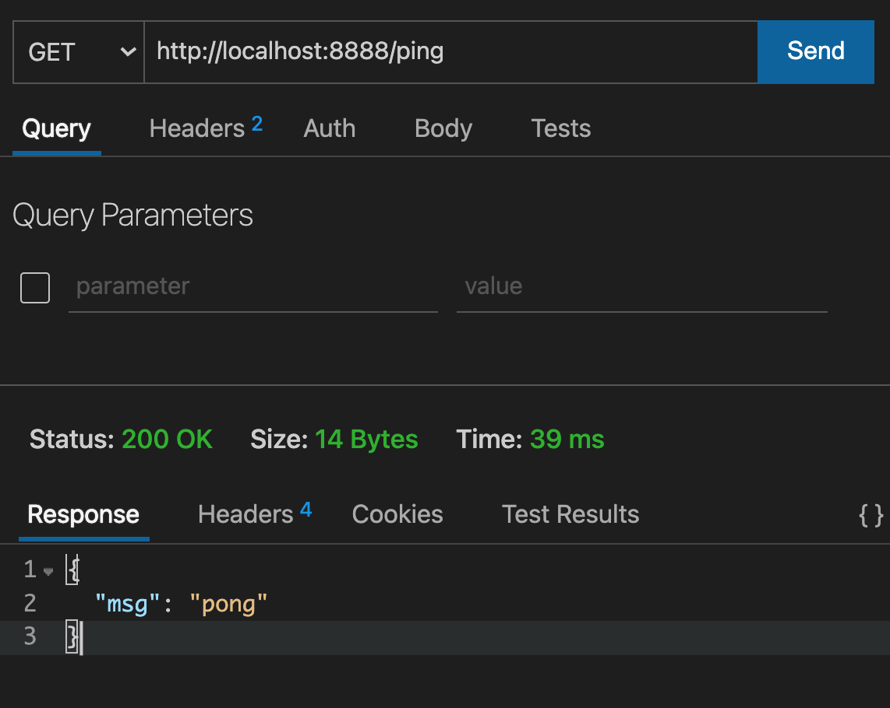
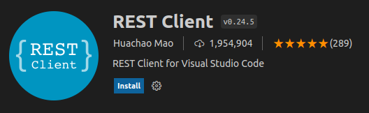
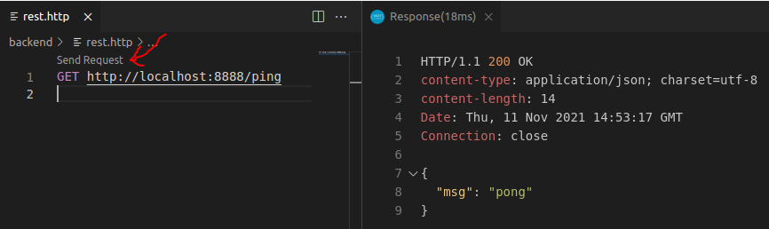
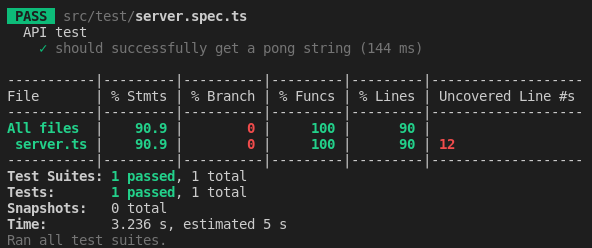
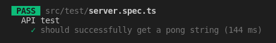
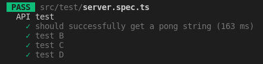
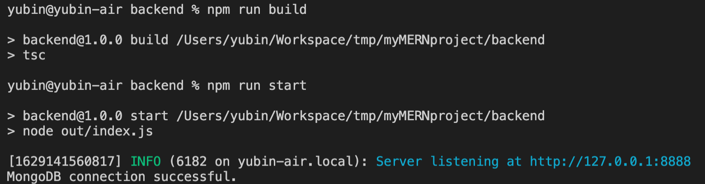

---

theme : "night"
transition: "slide"
highlightTheme: "monokai"
# logoImg: "logo.png"
slideNumber: true
title: "MERN Backend"

---

### MERN Backend & Jest Practice

<style>
pre {
  background: #303030;
  padding: 10px 16px;
  border-radius: 0.3em;
  counter-reset: line;
}
pre code[class*="="] .line {
  display: block;
  line-height: 1.8rem;
  font-size: 1em;
}
pre code[class*="="] .line:before {
  counter-increment: line;
  content: counter(line);
  display: inline-block;
  border-right: 3px solid #6ce26c !important;
  padding: 0 .5em;
  margin-right: .5em;
  color: #afafaf !important;
  width: 24px;
  text-align: right;
}

.reveal .slides > section > section {
  text-align:left; 
}

h1,h2,h3,h4 {
  text-align: center
}

p {
  text-align: center;
}

.present img {
    max-height: 65vh;
}
</style>

---

Yubin, Hsu

TSID / NTAP

ybhsu@tsmc.com

---

### Outline

- Create the backend project
- Jest
- MongoDB support

---

### Create the backend project

--

- Create project folder

```bash=
mkdir myMernProject
cd myMernProject
```

- Create backend project

```bash=
mkdir backend
cd backend
npm init
```

--

- Install dependencies of backend project

```bash=
npm i fastify pino-pretty dotenv
npm i -D typescript @types/node
npx tsc --init
```

--

Edit ```backend/tsconfig.json```

```json=
"include": ["src/**/*.ts"],
"exclude": ["node_modules"],

"compilerOptions": {
  "outDir": "./out",
  "rootDir": "./src",
}
```

--

Create ```backend/.env```

```plaintext
FASTIFY_PORT=8888
FASTIFY_ENABLE_LOGGING=true
ENV=dev
```

--

Create ```backend/src/server.ts```

```typescript=
import fastify, { FastifyInstance, FastifyReply, FastifyRequest } from 'fastify'
import { Server, IncomingMessage, ServerResponse } from 'http'

const server: FastifyInstance<Server, IncomingMessage, ServerResponse> = fastify({
    logger: { prettyPrint: true }
})

const startFastify: (port: number) => FastifyInstance<Server, IncomingMessage, ServerResponse> = (port) => {

    server.listen(port, '0.0.0.0', (err, _) => {
        if (err) {
            console.error(err)
        }
    })

    server.get('/ping', async (request: FastifyRequest, reply: FastifyReply) => {
        return reply.status(200).send({ msg: 'pong' })
    })

    return server
}

export { startFastify }
```

--

Create ```backend/src/index.ts```

```typescript=
import { startFastify } from './server'
import * as dotenv from 'dotenv'

dotenv.config()
const port = process.env.FASTIFY_PORT || 8888

// Start your server
const server = startFastify(Number(port))

export { server }
```

--

#### build and run

- build with tsc

```
tsc
```

- run with node

```
node out/index.js
```

--

Define custom npm scripts

- edit backend/package.json

```json=
"scripts": {
  "build": "tsc",
  "start": "node out/index.js"
},
```

--

Use custom npm script

```plaintext=
npm run build
npm run start
```

---

visit the endpoint



---

### API client

- Postman
- curl
- Thunder Client (vscode extension)
- REST Client (vscode extension)

--

Thunder Client



--

Send request by Thunder Client



--

REST Client



--

Send request by REST Client

create a .http file, send request




---

Create ```.gitignore```

```plaintext=
node_modules
out
```

--

get more .gitignore example

https://github.com/github/gitignore

---

### Jest

--

Jest

- JavaScript testing framework
- Open Source lead by Facebook
- https://github.com/facebook/jest
- https://jestjs.io/

--

Setup jest

```
npm i -D jest ts-jest @types/jest
```

- jest - **JavaScript testing framework**
- ts-jest - **TypeScript preprocessor for jest**
- @types/jest - **type definition for jest**

--

Jest config

https://jestjs.io/docs/configuration

create ```backend/jest.config.js```

```javascript
module.exports = {
  preset: "ts-jest",
  transform: {
    "^.+\\.(t|j)sx?$": "ts-jest",
  },
  testEnvironment: "node",
  moduleFileExtensions: [
    "ts",
    "tsx",
    "js",
    "jsx",
    "json",
    "node",
  ],
  testTimeout: 20000,
  testPathIgnorePatterns: [
    "/node_modules/",
    "/out/"
  ]
}
```

--

npm scripts

https://jestjs.io/docs/cli

```backend/package.json```

```
"scripts": {
  "test": "jest --verbose --coverage --runInBand",
  "build": "tsc",
  "start": "node out/index.js"
}
```

---

Create test file

--

Create ```src/test/server.spec.ts```

```typescript
import { FastifyInstance } from 'fastify'
import { startFastify } from '../server'
import { Server, IncomingMessage, ServerResponse } from 'http'

describe('API test', () => {
    let server: FastifyInstance<Server, IncomingMessage, ServerResponse>

    beforeAll(async () => {
        // await dbHandler.connect()
        server = startFastify(8888)
    })
    
    // afterEach(async () => {
    //     await dbHandler.clearDatabase()
    // })
    
    afterAll(async () => {
        try {
            // await dbHandler.closeDatabase()
            await server.close()
            console.log('Closing Fastify server is done!')
        } catch (e) {
            console.log(`Failed to close a Fastify server, reason: ${e}`)
        }
    })

    it('should successfully get a pong string', async () => {
        const response = await server.inject({ method: 'GET', url: '/ping' })

        expect(response.statusCode).toBe(200)
        expect(response.body).toStrictEqual(JSON.stringify({ msg: 'pong' }))
    })
})
```

--

Run test

```
npm run test
```



---

describe & it

```typescript
describe('API test', () => {
    it('should successfully get a pong string', () => {
        // Some testing condition
    })
})
```



--

```typescript
describe('API test', () => {
    it('should successfully get a pong string', () => {
        // Some testing condition
    })
    it('test B', () => {})
    it('test C', () => {})
    it('test D', () => {})
})
```



--

expect

```typescript
expect(response.statusCode).toBe(200)
expect(response.body).toStrictEqual(JSON.stringify({ msg: 'pong' }))
```

- toBe() - to compare primitive values or to check referential identity of object instances
- toStrictEqual() - to test that objects have the same types as well as structure

--

https://jestjs.io/docs/expect

```typescript
expect(1 + 2).toBeLessThan(4)
expect(1 + 2).toBeLessThanOrEqual(3)
expect(['A', 'B', 'C']).toContain('B')  
expect(1 + 2).not.toBe(4)
```

--

Synchronous

```typescript
describe('Math test', () => {
    it('1 + 2 should be 3', () => {
        const a = 1
        const b = 2
        expect(a + b).toBe(3)
    })
})
```

--

Asynchronous

```typescript
// pong.ts
async getPong(): Promise<string> {
    return new Promise((resolve) => {
        resolve('pong')
    })
}

// pong.spec.ts
describe('asynchronous test', () => {
    it('get pong', async () => {
        const result = await pong.getPong()
        expect(result).toBe('pong')
    })
    it('still get pong', async () => {
        await expect(pong.getPong()).resolves.toBe('pong')
    })
})
```

---

Add mongo support

--

Start a mongodb server

- using docker

```
docker run -d -p 27017:27017 mongo
```

- or binary

```
./mongod.exe
```

--

Install mongoose

```
npm i mongoose
npm i -D @types/mongoose
```

--

Add env variables in ```backend/.env```

```
MONGO_HOST=localhost
MONGO_PORT=27017
MONGO_DATABASE=myMERN
```

--

Create ```backend/src/plugins/mongoose.ts```

```typescript=
import mongoose from 'mongoose'

const host = process.env.MONGO_HOST || 'localhost'
const port = process.env.MONGO_PORT || 27017
const database = process.env.MONGO_DATABASE || 'fastify'

const establishConnection = () => {
  if (!process.env.JEST_WORKER_ID && mongoose.connection.readyState === 0) {
    mongoose.connect(
      `mongodb://${host}:${port}/${database}`,
      (err) => {
        if (!err) console.log('MongoDB connection successful.')
        else console.log('Error in DB connection : ' + JSON.stringify(err, undefined, 2))
      }
    )
  }
}

export { establishConnection }
```

--

Edit ```backend/src/server.ts```

```typescript=
import { establishConnection } from './plugins/mongoose'

// ...

  server.listen(port, (err, _) => {
      if (err) {
          console.error(err)
      }
      establishConnection()
  })

// ...
```

--

Start server



**MongoDB connection successful**

---

Install mongodb-memory-server

```
npm i -D mongodb-memory-server
```

--

Create ```src/test/db.ts```

```typescript
import mongoose from 'mongoose'
import { MongoMemoryServer } from 'mongodb-memory-server'

const mongod = new MongoMemoryServer()

/**
 * Connect to mock memory db.
 */
export const connect = async (): Promise<void> => {
    await mongod.start()
    const uri = mongod.getUri()
    await mongoose.connect(uri)
}

/**
 * Close db connection
 */
export const closeDatabase: () => Promise<void> = async () => {
    await mongoose.connection.dropDatabase()
    await mongoose.connection.close()
    await mongod.stop()
}

/**
 * Delete db collections
 */
export const clearDatabase: () => Promise<void> = async () => {
    const collections = mongoose.connection.collections

    for (const key in collections) {
        const collection = collections[key]
        await collection.deleteMany({})
    }
}
```

---

Rebuild automatically when the code is changed

--

- Install concurrently and nodemon

```
npm i -D concurrently nodemon
```

- add the script in package.json

```planttext
"dev": "concurrently \"tsc -w \" \"nodemon out/index.js\""
```

- Run the script

```
npm run dev
```

---

### prettier

--

Install prettier

```
npm i -D prettier
```

--

Add ```backend/.prettierrc```

```planttext
{
  "semi": false,
  "singleQuote": true,
  "printWidth": 120,
  "trailingComma": "none",
  "arrowParens": "always"
}
```

ref: https://prettier.io/docs/en/options.html

--

- Add the script in ```package.json```

```planttext
"fix-prettier": "prettier --write \"./{src,test,examples,scripts}/**/*.ts\""
```

- format code by prettier

```
npm run fix-prettier
```

---

end